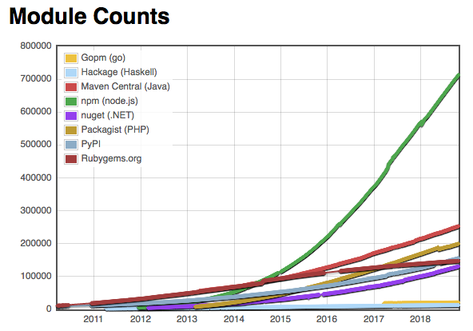

# Node.js
and Webservers

---

## What?
...
> Node.js® is a JavaScript runtime built on Chrome's V8 JavaScript engine.
> [https://nodejs.org/en/](https://nodejs.org/en/)
...
Node.js enables executing Javascript in environments other than the browser, eg. server

Note: Similar to other interpreted languages eg. Python

---

## Why?
...
### Javascript is simple and C-like

Easy to pickup, familiar to anyone who has learnt a C family language
...
### Javascript is flexible

Fits multiple paradigms eg. functional, object-oriented programming (OOP)
...
### Largest amount of packages

[http://www.modulecounts.com/](http://www.modulecounts.com/)
Note: Speed of development
...
### Highly scalable*

Asynchronous evented model with I/O requests delegated to system level

\*Terms and conditions apply *(topic for another day)*

---

## Useful resources
- [Node.js Documentation for latest version](https://nodejs.org/dist/latest/docs/api/index.html)
- [Mozilla Developer Network Javascript Reference](https://developer.mozilla.org/en-US/docs/Web/JavaScript/Reference)
- [Check Node.js support for Javascript language features](https://node.green/)
- [Manage multiple Node.js versions](https://www.npmjs.com/package/n)

---

## Koa
...
### Lightweight web framework

Bring your own plugins
Note: Flexibility, freedom of choice, no need to bundle irrelevant packages
...
### Hello World

<pre><code data-trim data-noescape>
    const Koa = require('koa');
    const app = new Koa();

    app.use(async (ctx, next) => {
        ctx.body = 'Hello World';
    });

    app.listen(3000);

    // Any call to http://localhost:3000 will return Hello World
</code></pre>

https://koajs.com/#application

...
### Middleware

* A function through which a request and corresponding response will flow through
* Registered to Koa in a middleware stack with `app.use`
* Control handed to next middleware in stack with `await next()`
* Context `ctx` for a request passed through the middleware stack
...
### Middleware

https://docs.microsoft.com/en-us/aspnet/core/fundamentals/middleware/index?view=aspnetcore-2.1
...
### Simple routing
<pre><code data-trim data-noescape>
    const timeController = async (ctx, next) => {
        if (ctx.request.method === 'GET' &&
            ctx.request.path === '/time') {
            return new Date().toISOString();
        } else {
            await next();
        }
    };

    app.use(timeController);
</code></pre>

---

## Hands-on
...
Install Node.js version >= 7.6.0
...
Clone with git or copy the files from

https://github.com/ksami/node-workshop
...
<pre><code data-trim data-noescape>
    cd src
    npm install
    node index.js
</code></pre>
...
#### `package.json`
[NPM metadata for your project](https://docs.npmjs.com/files/package.json)
...

1. 
Add a route for POST /api/user/:id and save request body to `database`

2. 
Add a route for GET /api/user/:id and return the saved request body from `database`

3. 
Add logs for request and response with the same randomly-generated correlation id for each log statement

4. 
Return HTTP 400 if X-Api-Key in request header !== 'secretKey', 500 for any other errors

---

# Fin
